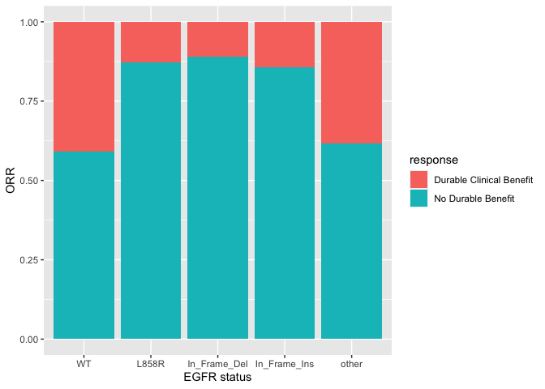
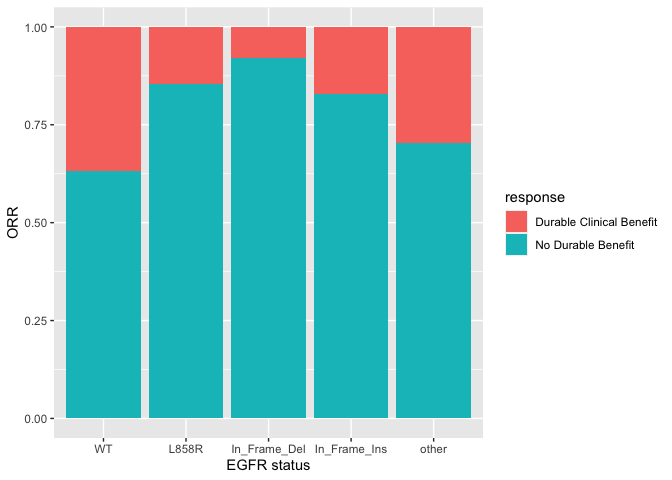
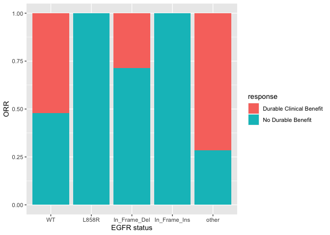
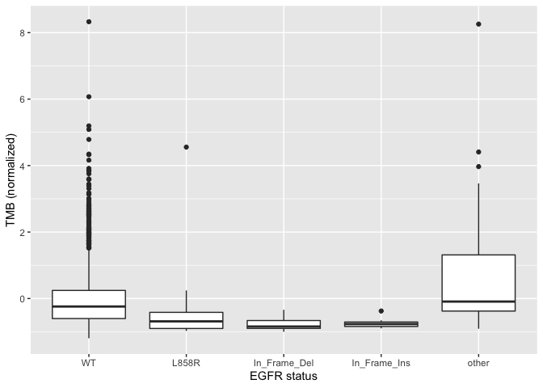

``` r
#dataset 1
library(readr)
nsclc_pd1_msk_2018 <- read_delim("~/Yossi/nsclc_pd1_msk_2018_clinical_data.tsv",
"\t", escape_double = FALSE, trim_ws = TRUE)
```

    ## Parsed with column specification:
    ## cols(
    ##   .default = col_character(),
    ##   `Diagnosis Age` = col_double(),
    ##   FGA = col_double(),
    ##   `Fraction Genome Altered` = col_double(),
    ##   `Lines of treatment` = col_double(),
    ##   `Mutation Count` = col_double(),
    ##   `Mutation Rate` = col_double(),
    ##   `PD-L1 Score (%)` = col_double(),
    ##   `Progress Free Survival (Months)` = col_double(),
    ##   `Number of Samples Per Patient` = col_double()
    ## )

    ## See spec(...) for full column specifications.

``` r
data_mutations_extended <- read_delim("~/Yossi/nsclc_pd1_msk_2018/data_mutations_extended.txt",
"\t", escape_double = FALSE, trim_ws = TRUE)
```

    ## Parsed with column specification:
    ## cols(
    ##   .default = col_character(),
    ##   Entrez_Gene_Id = col_double(),
    ##   Start_Position = col_double(),
    ##   End_Position = col_double(),
    ##   dbSNP_Val_Status = col_logical(),
    ##   Matched_Norm_Sample_Barcode = col_logical(),
    ##   Match_Norm_Seq_Allele1 = col_logical(),
    ##   Match_Norm_Seq_Allele2 = col_logical(),
    ##   Tumor_Validation_Allele1 = col_logical(),
    ##   Tumor_Validation_Allele2 = col_logical(),
    ##   Match_Norm_Validation_Allele1 = col_logical(),
    ##   Match_Norm_Validation_Allele2 = col_logical(),
    ##   Verification_Status = col_logical(),
    ##   Sequencing_Phase = col_logical(),
    ##   Sequence_Source = col_logical(),
    ##   Validation_Method = col_logical(),
    ##   BAM_File = col_logical(),
    ##   Sequencer = col_logical(),
    ##   t_ref_count = col_double(),
    ##   t_alt_count = col_double(),
    ##   n_ref_count = col_double()
    ##   # ... with 3 more columns
    ## )
    ## See spec(...) for full column specifications.

    ## Warning: 105 parsing failures.
    ##  row                         col           expected actual                                                     file
    ## 2483 Matched_Norm_Sample_Barcode 1/0/T/F/TRUE/FALSE NORMAL '~/Yossi/nsclc_pd1_msk_2018/data_mutations_extended.txt'
    ## 2483 Match_Norm_Seq_Allele1      1/0/T/F/TRUE/FALSE C      '~/Yossi/nsclc_pd1_msk_2018/data_mutations_extended.txt'
    ## 2483 Match_Norm_Seq_Allele2      1/0/T/F/TRUE/FALSE C      '~/Yossi/nsclc_pd1_msk_2018/data_mutations_extended.txt'
    ## 2484 Matched_Norm_Sample_Barcode 1/0/T/F/TRUE/FALSE NORMAL '~/Yossi/nsclc_pd1_msk_2018/data_mutations_extended.txt'
    ## 2484 Match_Norm_Seq_Allele1      1/0/T/F/TRUE/FALSE C      '~/Yossi/nsclc_pd1_msk_2018/data_mutations_extended.txt'
    ## .... ........................... .................. ...... ........................................................
    ## See problems(...) for more details.

``` r
EGFR_muts <- data_mutations_extended[data_mutations_extended$Hugo_Symbol == "EGFR",]

EGFR_In_Frame_Del <- unique(EGFR_muts$Tumor_Sample_Barcode[EGFR_muts$Variant_Classification == "In_Frame_Del"])
EGFR_In_Frame_Ins <- unique(EGFR_muts$Tumor_Sample_Barcode[EGFR_muts$Variant_Classification == "In_Frame_Ins"])
EGFR_L858R <- unique(EGFR_muts$Tumor_Sample_Barcode[EGFR_muts$HGVSp_Short == "p.L858R"])
EGFR_other <- unique(EGFR_muts$Tumor_Sample_Barcode[!(EGFR_muts$HGVSp_Short %in% c("p.L858R","p.E746_A750del","p.S752_I759del","p.L747_A750delinsP","p.S768_D770dup","p.P772_H773dup","p.D770_N771insY","p.H773dup"))])
nsclc_pd1_msk_2018$EGFR_In_Frame_Del <- c("no","yes")[as.numeric(sapply(nsclc_pd1_msk_2018$`Sample ID`, function(x) x %in% EGFR_In_Frame_Del)) + 1]
nsclc_pd1_msk_2018$EGFR_In_Frame_Ins <- c("no","yes")[as.numeric(sapply(nsclc_pd1_msk_2018$`Sample ID`, function(x) x %in% EGFR_In_Frame_Ins)) + 1]
nsclc_pd1_msk_2018$EGFR_L858R <- c("no","yes")[as.numeric(sapply(nsclc_pd1_msk_2018$`Sample ID`, function(x) x %in% EGFR_L858R)) + 1]
nsclc_pd1_msk_2018$EGFR_other <- c("no","yes")[as.numeric(sapply(nsclc_pd1_msk_2018$`Sample ID`, function(x) x %in% EGFR_other)) + 1]
EGFR_status <- rep("WT", nrow(nsclc_pd1_msk_2018))
EGFR_status[nsclc_pd1_msk_2018$EGFR_other == "yes"] = "other"
EGFR_status[nsclc_pd1_msk_2018$EGFR_L858R == "yes"] = "L858R"
EGFR_status[nsclc_pd1_msk_2018$EGFR_In_Frame_Ins == "yes"] = "In_Frame_Ins"
EGFR_status[nsclc_pd1_msk_2018$EGFR_In_Frame_Del == "yes"] = "In_Frame_Del"
nsclc_pd1_msk_2018$EGFR_status = EGFR_status


d1 <- data.frame(response = as.numeric(nsclc_pd1_msk_2018$`Durable Clinical Benefit`[nsclc_pd1_msk_2018$`Durable Clinical Benefit` != "NE"] == "YES"), EGFR = c("MUT","WT")[as.numeric(nsclc_pd1_msk_2018$EGFR_status[nsclc_pd1_msk_2018$`Durable Clinical Benefit` != "NE"] == "WT")+1], TMB = scale(nsclc_pd1_msk_2018$`Mutation Rate`[nsclc_pd1_msk_2018$`Durable Clinical Benefit` != "NE"]), EGFR_status = nsclc_pd1_msk_2018$EGFR_status[nsclc_pd1_msk_2018$`Durable Clinical Benefit` != "NE"], treatment_type = nsclc_pd1_msk_2018$`Treatment Type`[nsclc_pd1_msk_2018$`Durable Clinical Benefit` != "NE"])
rownames(d1) <- nsclc_pd1_msk_2018$`Sample ID`[nsclc_pd1_msk_2018$`Durable Clinical Benefit` != "NE"]
```

``` r
#dataset 2
library(readxl)
data_mutations_extended <- read_excel("~/Yossi/43018_2019_8_MOESM2_ESM.xlsx",sheet = "S3", skip = 1)
```

    ## Warning in read_fun(path = enc2native(normalizePath(path)), sheet_i = sheet, :
    ## Expecting numeric in M11392 / R11392C13: got 'NA'

``` r
nsclc_2020 <- read_excel("~/Yossi/43018_2019_8_MOESM2_ESM.xlsx",sheet = "S1", skip = 1)
nsclc_2020 <- nsclc_2020[1:89,]
TMB_data <- read_excel("~/Yossi/43018_2019_8_MOESM8_ESM.xlsx",sheet = "ED1")
nsclc_2020$TMB = TMB_data$TMB
nsclc_2020$cTMB = TMB_data$cTMB
EGFR_muts <- data_mutations_extended[data_mutations_extended$Gene == "EGFR",]
EGFR_In_Frame_Del <- unique(EGFR_muts$`Patient ID`[EGFR_muts$`Mutation Type` == "Deletion"])
EGFR_In_Frame_Ins <- unique(EGFR_muts$`Patient ID`[EGFR_muts$`Mutation Type` == "Insertion"])
EGFR_L858R <- unique(EGFR_muts$`Patient ID`[EGFR_muts$`Amino Acid (protein)` == "858L>R"])
EGFR_other <- unique(EGFR_muts$`Patient ID`[EGFR_muts$`Mutation Type` == "Substitution" & EGFR_muts$`Amino Acid (protein)` != "858L>R"])

nsclc_2020$EGFR_In_Frame_Del <- c("no","yes")[as.numeric(sapply(nsclc_2020$`Patient ID`, function(x) x %in% EGFR_In_Frame_Del)) + 1]
nsclc_2020$EGFR_In_Frame_Ins <- c("no","yes")[as.numeric(sapply(nsclc_2020$`Patient ID`, function(x) x %in% EGFR_In_Frame_Ins)) + 1]
nsclc_2020$EGFR_L858R <- c("no","yes")[as.numeric(sapply(nsclc_2020$`Patient ID`, function(x) x %in% EGFR_L858R)) + 1]
nsclc_2020$EGFR_other <- c("no","yes")[as.numeric(sapply(nsclc_2020$`Patient ID`, function(x) x %in% EGFR_other)) + 1]


EGFR_status <- rep("WT", nrow(nsclc_2020))
EGFR_status[nsclc_2020$EGFR_other == "yes"] = "other"
EGFR_status[nsclc_2020$EGFR_L858R == "yes"] = "L858R"
EGFR_status[nsclc_2020$EGFR_In_Frame_Ins == "yes"] = "In_Frame_Ins"
EGFR_status[nsclc_2020$EGFR_In_Frame_Del == "yes"] = "In_Frame_Del"
nsclc_2020$EGFR_status = EGFR_status

nsclc_2020 <- nsclc_2020[nsclc_2020$`Clinical Benefit` != "N/A",]

d2 <- data.frame(response = as.numeric(nsclc_2020$`Clinical Benefit` == "DCB"), EGFR = c("MUT","WT")[as.numeric(nsclc_2020$EGFR_status == "WT")+1], TMB = scale(nsclc_2020$TMB), EGFR_status = nsclc_2020$EGFR_status, treatment_type = nsclc_2020$Treatment)

rownames(d2) <- nsclc_2020$`Patient ID`
```

``` r
#dataset 3:
mskcc_2018 <- read_delim("~/Yossi/nsclc_mskcc_2018_clinical_data.tsv", 
    "\t", escape_double = FALSE, trim_ws = TRUE)
```

    ## Parsed with column specification:
    ## cols(
    ##   .default = col_character(),
    ##   `Age (yrs)` = col_double(),
    ##   `ECOG performance status` = col_double(),
    ##   `Mutation Count` = col_double(),
    ##   `Nonsynonymous Mutation Burden` = col_double(),
    ##   `PD-L1 expression (Percentage)` = col_double(),
    ##   `Progress Free Survival (Months)` = col_double(),
    ##   `Predicted neoantigen burden` = col_double(),
    ##   `Number of Samples Per Patient` = col_double()
    ## )

    ## See spec(...) for full column specifications.

``` r
data_mutations_extended <- read_delim("~/Yossi/nsclc_mskcc_2018/data_mutations_extended.txt","\t", escape_double = FALSE, trim_ws = TRUE)
```

    ## Parsed with column specification:
    ## cols(
    ##   .default = col_logical(),
    ##   Hugo_Symbol = col_character(),
    ##   Entrez_Gene_Id = col_double(),
    ##   Center = col_character(),
    ##   NCBI_Build = col_character(),
    ##   Chromosome = col_character(),
    ##   Start_Position = col_double(),
    ##   End_Position = col_double(),
    ##   Strand = col_character(),
    ##   Consequence = col_character(),
    ##   Variant_Classification = col_character(),
    ##   Variant_Type = col_character(),
    ##   Reference_Allele = col_character(),
    ##   Tumor_Seq_Allele1 = col_character(),
    ##   Tumor_Seq_Allele2 = col_character(),
    ##   Tumor_Sample_Barcode = col_character(),
    ##   HGVSc = col_character(),
    ##   HGVSp = col_character(),
    ##   HGVSp_Short = col_character(),
    ##   Transcript_ID = col_character(),
    ##   RefSeq = col_character()
    ##   # ... with 6 more columns
    ## )
    ## See spec(...) for full column specifications.

``` r
EGFR_muts <- data_mutations_extended[data_mutations_extended$Hugo_Symbol == "EGFR",]

EGFR_In_Frame_Del <- unique(EGFR_muts$Tumor_Sample_Barcode[EGFR_muts$Variant_Classification == "In_Frame_Del"])
EGFR_In_Frame_Ins <- unique(EGFR_muts$Tumor_Sample_Barcode[EGFR_muts$Variant_Classification == "In_Frame_Ins"])
EGFR_L858R <- unique(EGFR_muts$Tumor_Sample_Barcode[EGFR_muts$HGVSp_Short == "p.L858R"])
EGFR_other <- unique(EGFR_muts$Tumor_Sample_Barcode[!(EGFR_muts$Variant_Classification %in% c("In_Frame_Ins","In_Frame_Del") | EGFR_muts$HGVSp_Short == "p.L858R")])

mskcc_2018$EGFR_In_Frame_Del <- c("no","yes")[as.numeric(sapply(mskcc_2018$`Sample ID`, function(x) x %in% EGFR_In_Frame_Del)) + 1]
mskcc_2018$EGFR_In_Frame_Ins <- c("no","yes")[as.numeric(sapply(mskcc_2018$`Sample ID`, function(x) x %in% EGFR_In_Frame_Ins)) + 1]
mskcc_2018$EGFR_L858R <- c("no","yes")[as.numeric(sapply(mskcc_2018$`Sample ID`, function(x) x %in% EGFR_L858R)) + 1]
mskcc_2018$EGFR_other <- c("no","yes")[as.numeric(sapply(mskcc_2018$`Sample ID`, function(x) x %in% EGFR_other)) + 1]
EGFR_status <- rep("WT", nrow(mskcc_2018))
EGFR_status[mskcc_2018$EGFR_other == "yes"] = "other"
EGFR_status[mskcc_2018$EGFR_L858R == "yes"] = "L858R"
EGFR_status[mskcc_2018$EGFR_In_Frame_Ins == "yes"] = "In_Frame_Ins"
EGFR_status[mskcc_2018$EGFR_In_Frame_Del == "yes"] = "In_Frame_Del"
mskcc_2018$EGFR_status = EGFR_status

d3 <- data.frame(response = as.numeric(mskcc_2018$`Durable Clinical Benefit` == "Durable Clinical Benefit"), EGFR = c("MUT","WT")[as.numeric(mskcc_2018$EGFR_status == "WT")+1], TMB = scale(mskcc_2018$`Nonsynonymous Mutation Burden`), EGFR_status = mskcc_2018$EGFR_status, treatment_type = rep("anti-PD1 + anti-CTLA4", nrow(mskcc_2018)))

rownames(d3) <- mskcc_2018$`Sample ID`
```

``` r
#dataset4
mskcc_2015 <- read_delim("~/Yossi/nsclc_mskcc_2015_clinical_data.tsv", 
    "\t", escape_double = FALSE, trim_ws = TRUE)
```

    ## Parsed with column specification:
    ## cols(
    ##   .default = col_character(),
    ##   `Patient Current Age` = col_double(),
    ##   Dosage = col_double(),
    ##   `Mean Target Coverage Normal` = col_double(),
    ##   `Mean Target Coverage Tumor` = col_double(),
    ##   `Mutation Count` = col_double(),
    ##   `Neoantigen Burden` = col_double(),
    ##   `Nonsynonymous mutation burden` = col_double(),
    ##   `Progress Free Survival (Months)` = col_double(),
    ##   `Prior Treatment Of Cytotoxic ChemoTransversion High erapy` = col_double(),
    ##   `Number of Samples Per Patient` = col_double(),
    ##   `Person Cigarette Smoking History Pack Year Value` = col_double(),
    ##   `Total Exonic Mutation Burden` = col_double(),
    ##   `Treatment Schedule` = col_double()
    ## )

    ## See spec(...) for full column specifications.

``` r
data_mutations_extended <- read_delim("~/Yossi/nsclc_mskcc_2015/data_mutations_extended.txt","\t", escape_double = FALSE, trim_ws = TRUE)
```

    ## Parsed with column specification:
    ## cols(
    ##   .default = col_character(),
    ##   Entrez_Gene_Id = col_double(),
    ##   Start_Position = col_double(),
    ##   End_Position = col_double(),
    ##   dbSNP_RS = col_logical(),
    ##   dbSNP_Val_Status = col_logical(),
    ##   Matched_Norm_Sample_Barcode = col_logical(),
    ##   Match_Norm_Seq_Allele1 = col_logical(),
    ##   Match_Norm_Seq_Allele2 = col_logical(),
    ##   Tumor_Validation_Allele1 = col_logical(),
    ##   Tumor_Validation_Allele2 = col_logical(),
    ##   Match_Norm_Validation_Allele1 = col_logical(),
    ##   Match_Norm_Validation_Allele2 = col_logical(),
    ##   Verification_Status = col_logical(),
    ##   Validation_Status = col_logical(),
    ##   Sequencing_Phase = col_logical(),
    ##   Validation_Method = col_logical(),
    ##   Score = col_logical(),
    ##   BAM_File = col_logical(),
    ##   t_ref_count = col_logical(),
    ##   t_alt_count = col_logical()
    ##   # ... with 8 more columns
    ## )
    ## See spec(...) for full column specifications.

``` r
EGFR_muts <- data_mutations_extended[data_mutations_extended$Hugo_Symbol == "EGFR",]

EGFR_In_Frame_Del <- unique(EGFR_muts$Tumor_Sample_Barcode[EGFR_muts$Variant_Classification == "In_Frame_Del"])
EGFR_In_Frame_Ins <- unique(EGFR_muts$Tumor_Sample_Barcode[EGFR_muts$Variant_Classification == "In_Frame_Ins"])
EGFR_L858R <- unique(EGFR_muts$Tumor_Sample_Barcode[EGFR_muts$HGVSp_Short == "p.L858R"])
EGFR_other <- unique(EGFR_muts$Tumor_Sample_Barcode[!(EGFR_muts$Variant_Classification %in% c("In_Frame_Ins","In_Frame_Del") | EGFR_muts$HGVSp_Short == "p.L858R")])

mskcc_2015$EGFR_In_Frame_Del <- c("no","yes")[as.numeric(sapply(mskcc_2015$`Sample ID`, function(x) x %in% EGFR_In_Frame_Del)) + 1]
mskcc_2015$EGFR_In_Frame_Ins <- c("no","yes")[as.numeric(sapply(mskcc_2015$`Sample ID`, function(x) x %in% EGFR_In_Frame_Ins)) + 1]
mskcc_2015$EGFR_L858R <- c("no","yes")[as.numeric(sapply(mskcc_2015$`Sample ID`, function(x) x %in% EGFR_L858R)) + 1]
mskcc_2015$EGFR_other <- c("no","yes")[as.numeric(sapply(mskcc_2015$`Sample ID`, function(x) x %in% EGFR_other)) + 1]
EGFR_status <- rep("WT", nrow(mskcc_2015))
EGFR_status[mskcc_2015$EGFR_other == "yes"] = "other"
EGFR_status[mskcc_2015$EGFR_L858R == "yes"] = "L858R"
EGFR_status[mskcc_2015$EGFR_In_Frame_Ins == "yes"] = "In_Frame_Ins"
EGFR_status[mskcc_2015$EGFR_In_Frame_Del == "yes"] = "In_Frame_Del"
mskcc_2015$EGFR_status = EGFR_status


d4 <- data.frame(response = as.numeric(mskcc_2015$`Durable Clinical Benefit` == "DCB"), EGFR = c("MUT","WT")[as.numeric(mskcc_2015$EGFR_status == "WT")+1], TMB = scale(mskcc_2015$`Nonsynonymous mutation burden`), EGFR_status = mskcc_2015$EGFR_status, treatment_type = rep("anti-PD1(pembrolizumab)",nrow(mskcc_2015)))

rownames(d4) <- mskcc_2015$`Sample ID`
```

``` r
hastings2019_EGFRWT <- read_excel("~/Yossi/mdz141-suppl_data/Summary of characteristics of EGFR WT patients treated with immune checkpoint inhibitors.xlsx")

hastings2019_EGFRWT$response <- sapply(1:nrow(hastings2019_EGFRWT), function(i) {
  if(hastings2019_EGFRWT$`Best Overall Response`[i] %in% c("PR","CR"))
    return("Durable Clinical Benefit")
  else if(hastings2019_EGFRWT$`Best Overall Response`[i] == "SD" & hastings2019_EGFRWT$`PFS (mo)`[i] > 6)
    return("Durable Clinical Benefit")
  else
    return("No Durable Benefit")
})
hastings2019_EGFR_Mut <- read_excel("~/Yossi/mdz141-suppl_data/Summary of patient characteristics for EGFR mutant patients treated with immune checkpoint inhibitors.xlsx")
hastings2019_EGFR_Mut$response <- sapply(1:nrow(hastings2019_EGFR_Mut), function(i) {
  if(hastings2019_EGFR_Mut$`Best Response`[i] %in% c("PR","CR"))
    return("Durable Clinical Benefit")
  else if(hastings2019_EGFR_Mut$`Best Response`[i] == "SD" & hastings2019_EGFR_Mut$`PFS (mo)`[i] > 6)
    return("Durable Clinical Benefit")
  else
    return("No Durable Benefit")
})
hastings2019_TMB <- read_excel("~/Yossi/mdz141-suppl_data/Summary of characteristics of patients included in the tumor mutation burden analysis.xlsx")
hastings2019_TMB$`Non-synonymous Mutations/Mb` <- scale(hastings2019_TMB$`Non-synonymous Mutations/Mb`)
hastings2019_EGFRWT$TMB = sapply(hastings2019_EGFRWT$STUDY_ID, function(x) {
  idx = which(hastings2019_TMB$`Sample ID` == x)
  if(length(idx) == 1)
    return(hastings2019_TMB$`Non-synonymous Mutations/Mb`[idx])
  else
    return(NA)
})

hastings2019_EGFR_Mut$TMB = sapply(hastings2019_EGFR_Mut$`Study ID`, function(x) {
  idx = which(hastings2019_TMB$`Sample ID` == x)
  if(length(idx) == 1)
    return(hastings2019_TMB$`Non-synonymous Mutations/Mb`[idx])
  else
    return(NA)
})

hastings2019 <- data.frame(EGFR_status = c(rep("WT", nrow(hastings2019_EGFRWT)), hastings2019_EGFR_Mut$`EGFR Mutation`), TMB = c(hastings2019_EGFRWT$TMB, hastings2019_EGFR_Mut$TMB), response = c(hastings2019_EGFRWT$response, hastings2019_EGFR_Mut$response), treatment_type = c(rep("NA", nrow(hastings2019_EGFRWT)),hastings2019_EGFR_Mut$`Immune Target`))

rownames(hastings2019) <- c(hastings2019_EGFRWT$STUDY_ID, hastings2019_EGFR_Mut$`Study ID`)
hastings2019$EGFR_status <- as.character(hastings2019$EGFR_status)
hastings2019$response <- as.numeric(hastings2019$response == "Durable Clinical Benefit")
hastings2019$EGFR_status[hastings2019$EGFR_status == "Del19"] = "In_Frame_Del"
hastings2019$EGFR_status[hastings2019$EGFR_status == "20ins"] = "In_Frame_Ins"
hastings2019$EGFR_status[hastings2019$EGFR_status %in% c("L861Q","G719","Other")] = "other"
hastings2019$EGFR <- c("MUT","WT")[as.numeric(hastings2019$EGFR_status == "WT")+1]
hastings2019 <- hastings2019[,colnames(d4)]
hastings2019$treatment_type <- as.character(hastings2019$treatment_type)
```

``` r
DD <- rbind(rbind(d1,d2),rbind(d3,d4))
DD <- rbind(DD, hastings2019[!(rownames(hastings2019) %in% rownames(DD)),])
```

``` r
idx_combo <- DD$treatment_type %in% c("Combination","Dual ICB (anti-PD1+anti-CTLA4)","Anti-PD1 + Chemotherapy","anti-PD1 + anti-CTLA4","CTLA-4 + PD-1","CTLA-4 + PD-L1")
```

``` r
library(lmtest)
```

    ## Loading required package: zoo

    ## 
    ## Attaching package: 'zoo'

    ## The following objects are masked from 'package:base':
    ## 
    ##     as.Date, as.Date.numeric

``` r
D1 <- DD
D1$EGFR <- c("MUT","WT")[as.numeric(DD$EGFR_status %in% c("WT"))+1]
m1 <- lm(response ~ TMB, data = DD[!idx_combo,])
m2 <- lm(response ~ TMB + EGFR, data = D1[!idx_combo,])

print(lrtest(m1,m2))
```

    ## Likelihood ratio test
    ## 
    ## Model 1: response ~ TMB
    ## Model 2: response ~ TMB + EGFR
    ##   #Df  LogLik Df  Chisq Pr(>Chisq)  
    ## 1   3 -184.24                       
    ## 2   4 -181.38  1 5.7262    0.01671 *
    ## ---
    ## Signif. codes:  0 '***' 0.001 '**' 0.01 '*' 0.05 '.' 0.1 ' ' 1

``` r
print(summary(m2))
```

    ## 
    ## Call:
    ## lm(formula = response ~ TMB + EGFR, data = D1[!idx_combo, ])
    ## 
    ## Residuals:
    ##     Min      1Q  Median      3Q     Max 
    ## -0.8650 -0.3209 -0.2547  0.5562  0.9398 
    ## 
    ## Coefficients:
    ##             Estimate Std. Error t value Pr(>|t|)    
    ## (Intercept)  0.13322    0.08557   1.557   0.1206    
    ## TMB          0.11932    0.02650   4.502 9.79e-06 ***
    ## EGFRWT       0.21529    0.08999   2.392   0.0174 *  
    ## ---
    ## Signif. codes:  0 '***' 0.001 '**' 0.01 '*' 0.05 '.' 0.1 ' ' 1
    ## 
    ## Residual standard error: 0.4527 on 289 degrees of freedom
    ##   (162 observations deleted due to missingness)
    ## Multiple R-squared:  0.08105,    Adjusted R-squared:  0.07469 
    ## F-statistic: 12.74 on 2 and 289 DF,  p-value: 4.962e-06

``` r
library(lmtest)
m1 <- lm(response ~ TMB, data = DD[idx_combo,])
m2 <- lm(response ~ TMB + EGFR, data = DD[idx_combo,])
print(lrtest(m1,m2))
```

    ## Likelihood ratio test
    ## 
    ## Model 1: response ~ TMB
    ## Model 2: response ~ TMB + EGFR
    ##   #Df  LogLik Df  Chisq Pr(>Chisq)
    ## 1   3 -76.438                     
    ## 2   4 -76.399  1 0.0782     0.7797

``` r
print(summary(m2))
```

    ## 
    ## Call:
    ## lm(formula = response ~ TMB + EGFR, data = DD[idx_combo, ])
    ## 
    ## Residuals:
    ##     Min      1Q  Median      3Q     Max 
    ## -0.6923 -0.4132 -0.1532  0.5270  0.6508 
    ## 
    ## Coefficients:
    ##             Estimate Std. Error t value Pr(>|t|)    
    ## (Intercept)  0.48355    0.10910   4.432 2.16e-05 ***
    ## TMB          0.18754    0.04528   4.142 6.64e-05 ***
    ## EGFRWT       0.03290    0.11914   0.276    0.783    
    ## ---
    ## Signif. codes:  0 '***' 0.001 '**' 0.01 '*' 0.05 '.' 0.1 ' ' 1
    ## 
    ## Residual standard error: 0.471 on 114 degrees of freedom
    ##   (15 observations deleted due to missingness)
    ## Multiple R-squared:  0.1355, Adjusted R-squared:  0.1203 
    ## F-statistic: 8.931 on 2 and 114 DF,  p-value: 0.0002494

``` r
library(dplyr)
```

    ## 
    ## Attaching package: 'dplyr'

    ## The following objects are masked from 'package:stats':
    ## 
    ##     filter, lag

    ## The following objects are masked from 'package:base':
    ## 
    ##     intersect, setdiff, setequal, union

``` r
library(ggplot2)
summary_dat <- DD %>% group_by(EGFR_status,response) %>% tally()
summary_dat$response <- c("No Durable Benefit","Durable Clinical Benefit")[summary_dat$response+1]
p1 <- ggplot(summary_dat, aes(fill=response, y=n, x=EGFR_status)) + scale_x_discrete(limits = c("WT","L858R","In_Frame_Del","In_Frame_Ins","other")) +
    geom_bar(position="fill", stat="identity") + ylab("ORR") + xlab("EGFR status")
print(p1)
```



``` r
pdf("~/Yossi/Figure1A_all.pdf")
print(p1)
dev.off()
```

    ## quartz_off_screen 
    ##                 2

``` r
tiff("~/Yossi/Figure1A_all.tiff")
print(p1)
dev.off()
```

    ## quartz_off_screen 
    ##                 2

``` r
print(summary_dat)
```

    ## # A tibble: 10 x 3
    ## # Groups:   EGFR_status [5]
    ##    EGFR_status  response                     n
    ##    <fct>        <chr>                    <int>
    ##  1 In_Frame_Del No Durable Benefit          80
    ##  2 In_Frame_Del Durable Clinical Benefit    10
    ##  3 In_Frame_Ins No Durable Benefit          30
    ##  4 In_Frame_Ins Durable Clinical Benefit     5
    ##  5 L858R        No Durable Benefit          48
    ##  6 L858R        Durable Clinical Benefit     7
    ##  7 other        No Durable Benefit          21
    ##  8 other        Durable Clinical Benefit    13
    ##  9 WT           No Durable Benefit         220
    ## 10 WT           Durable Clinical Benefit   152

``` r
library(dplyr)
library(ggplot2)
summary_dat <- DD[!idx_combo,] %>% group_by(EGFR_status,response) %>% tally()
summary_dat$response <- c("No Durable Benefit","Durable Clinical Benefit")[summary_dat$response+1]
p1 <- ggplot(summary_dat, aes(fill=response, y=n, x=EGFR_status)) + scale_x_discrete(limits = c("WT","L858R","In_Frame_Del","In_Frame_Ins","other")) + 
    geom_bar(position="fill", stat="identity") + ylab("ORR") + xlab("EGFR status")
print(p1)
```



``` r
pdf("~/Yossi/Figure1A_PD1_PDL1_only.pdf")
print(p1)
dev.off()
```

    ## quartz_off_screen 
    ##                 2

``` r
tiff("~/Yossi/Figure1A_PD1_PDL1_only.tiff")
print(p1)
dev.off()
```

    ## quartz_off_screen 
    ##                 2

``` r
print(summary_dat)
```

    ## # A tibble: 10 x 3
    ## # Groups:   EGFR_status [5]
    ##    EGFR_status  response                     n
    ##    <fct>        <chr>                    <int>
    ##  1 In_Frame_Del No Durable Benefit          70
    ##  2 In_Frame_Del Durable Clinical Benefit     6
    ##  3 In_Frame_Ins No Durable Benefit          24
    ##  4 In_Frame_Ins Durable Clinical Benefit     5
    ##  5 L858R        No Durable Benefit          41
    ##  6 L858R        Durable Clinical Benefit     7
    ##  7 other        No Durable Benefit          19
    ##  8 other        Durable Clinical Benefit     8
    ##  9 WT           No Durable Benefit         173
    ## 10 WT           Durable Clinical Benefit   101

``` r
library(dplyr)
library(ggplot2)
summary_dat <- DD[idx_combo,] %>% group_by(EGFR_status,response) %>% tally()
summary_dat$response <- c("No Durable Benefit","Durable Clinical Benefit")[summary_dat$response+1]
p1 <- ggplot(summary_dat, aes(fill=response, y=n, x=EGFR_status)) + scale_x_discrete(limits = c("WT","L858R","In_Frame_Del","In_Frame_Ins","other")) + 
    geom_bar(position="fill", stat="identity") + ylab("ORR") + xlab("EGFR status")
print(p1)
```



``` r
pdf("~/Yossi/Figure1A_PD1_CTLA4.pdf")
print(p1)
dev.off()
```

    ## quartz_off_screen 
    ##                 2

``` r
tiff("~/Yossi/Figure1A_PD1_CTLA4.tiff")
print(p1)
dev.off()
```

    ## quartz_off_screen 
    ##                 2

``` r
print(summary_dat)
```

    ## # A tibble: 8 x 3
    ## # Groups:   EGFR_status [5]
    ##   EGFR_status  response                     n
    ##   <fct>        <chr>                    <int>
    ## 1 In_Frame_Del No Durable Benefit          10
    ## 2 In_Frame_Del Durable Clinical Benefit     4
    ## 3 In_Frame_Ins No Durable Benefit           6
    ## 4 L858R        No Durable Benefit           7
    ## 5 other        No Durable Benefit           2
    ## 6 other        Durable Clinical Benefit     5
    ## 7 WT           No Durable Benefit          47
    ## 8 WT           Durable Clinical Benefit    51

``` r
DD2 <- DD
DD2$response <- c("No Durable Benefit","Durable Clinical Benefit")[DD$response+1]
write.table(DD2, file = "~/Yossi/Table_for_Fig1A.txt", sep = "\t", row.names = F, quote = F)
```

``` r
#read in corresponding TCGA clinical data
tcga_clinical <- suppressWarnings(read_excel("~/forKun/TCGA/TCGA-CDR-SupplementalTableS1.xlsx"))
```

    ## New names:
    ## * `` -> ...1

``` r
panTCGA_muts <- read_delim("~/Yossi/mc3.v0.2.8.PUBLIC.maf",
"\t", escape_double = FALSE, trim_ws = TRUE)
```

    ## Parsed with column specification:
    ## cols(
    ##   .default = col_character(),
    ##   Entrez_Gene_Id = col_double(),
    ##   Start_Position = col_double(),
    ##   End_Position = col_double(),
    ##   t_depth = col_double(),
    ##   t_ref_count = col_double(),
    ##   t_alt_count = col_double(),
    ##   n_depth = col_double(),
    ##   n_ref_count = col_double(),
    ##   n_alt_count = col_double(),
    ##   STRAND = col_double(),
    ##   NCALLERS = col_double()
    ## )

    ## See spec(...) for full column specifications.

``` r
patient_ids <- substr(panTCGA_muts$Tumor_Sample_Barcode,1,12)
is_nsclc <- patient_ids %in% tcga_clinical$bcr_patient_barcode[tcga_clinical$type %in% c("LUAD","LUSC")]
EGFR_muts <- panTCGA_muts[is_nsclc & panTCGA_muts$Hugo_Symbol == "EGFR",]
NSCLC_muts <- panTCGA_muts[is_nsclc,]
TMB <- sapply(unique(NSCLC_muts$Tumor_Sample_Barcode), function(x) {
  idx = NSCLC_muts$Tumor_Sample_Barcode == x
  return(sum(NSCLC_muts$Variant_Classification[idx] != "Silent"))
})


EGFR_In_Frame_Del <- unique(EGFR_muts$Tumor_Sample_Barcode[EGFR_muts$Variant_Classification == "In_Frame_Del"])
EGFR_In_Frame_Ins <- unique(EGFR_muts$Tumor_Sample_Barcode[EGFR_muts$Variant_Classification == "In_Frame_Ins"])
EGFR_L858R <- unique(EGFR_muts$Tumor_Sample_Barcode[EGFR_muts$HGVSp_Short == "p.L858R"])
EGFR_other <- unique(EGFR_muts$Tumor_Sample_Barcode[!(EGFR_muts$Variant_Classification %in% c("In_Frame_Ins","In_Frame_Del") | EGFR_muts$HGVSp_Short == "p.L858R")])

tcga_nsclc <- data.frame(Sample_ID = names(TMB), TMB = TMB)
tcga_nsclc$EGFR_In_Frame_Del <- c("no","yes")[as.numeric(sapply(tcga_nsclc$Sample_ID, function(x) x %in% EGFR_In_Frame_Del)) + 1]
tcga_nsclc$EGFR_In_Frame_Ins <- c("no","yes")[as.numeric(sapply(tcga_nsclc$Sample_ID, function(x) x %in% EGFR_In_Frame_Ins)) + 1]
tcga_nsclc$EGFR_L858R <- c("no","yes")[as.numeric(sapply(tcga_nsclc$Sample_ID, function(x) x %in% EGFR_L858R)) + 1]
tcga_nsclc$EGFR_other <- c("no","yes")[as.numeric(sapply(tcga_nsclc$Sample_ID, function(x) x %in% EGFR_other)) + 1]
EGFR_status <- rep("WT", nrow(tcga_nsclc))
EGFR_status[tcga_nsclc$EGFR_other == "yes"] = "other"
EGFR_status[tcga_nsclc$EGFR_L858R == "yes"] = "L858R"
EGFR_status[tcga_nsclc$EGFR_In_Frame_Ins == "yes"] = "In_Frame_Ins"
EGFR_status[tcga_nsclc$EGFR_In_Frame_Del == "yes"] = "In_Frame_Del"
tcga_nsclc$EGFR_status = EGFR_status
tcga_nsclc$Sample_ID <- substr(tcga_nsclc$Sample_ID, 1, 12)

nsclc_all <- data.frame(EGFR_status = c(as.character(DD$EGFR_status), as.character(tcga_nsclc$EGFR_status)), TMB = c(DD$TMB,scale(tcga_nsclc$TMB)), response = c(DD2$response, rep(NA, nrow(tcga_nsclc))))
```

``` r
library(ggpubr)
p2 <- ggplot(data = nsclc_all[!is.na(nsclc_all$TMB),], aes(x = EGFR_status, y = TMB)) + geom_boxplot() + ylab("TMB (normalized)") + xlab("EGFR status") + stat_compare_means() + scale_x_discrete(limits = c("WT","L858R","In_Frame_Del","In_Frame_Ins","other"))
print(p2)
```

    ## Warning: Computation failed in `stat_compare_means()`:
    ## all observations are in the same group



``` r
pdf("~/Yossi/Figure1B.pdf")
print(p2)
```

    ## Warning: Computation failed in `stat_compare_means()`:
    ## all observations are in the same group

``` r
dev.off()
```

    ## quartz_off_screen 
    ##                 2

``` r
tiff("~/Yossi/Figure1B.tiff")
print(p2)
```

    ## Warning: Computation failed in `stat_compare_means()`:
    ## all observations are in the same group

``` r
dev.off()
```

    ## quartz_off_screen 
    ##                 2

``` r
print(table(nsclc_all$EGFR_status))
```

    ## 
    ## In_Frame_Del In_Frame_Ins        L858R        other           WT 
    ##          117           37           77           80         1277

``` r
#tcga_luad_tpm <- readRDS("~/forKun/TCGA/lung_NSCLC_adenocarcinoma_exp_deconv/bulk.rds")
#tcga_lusc_tpm <- readRDS("~/forKun/TCGA/lung_NSCLC_squamous_cell_carcinoma_exp_deconv/bulk.rds")
#tcga_nsclc_tpm <- cbind(tcga_luad_tpm,tcga_lusc_tpm)
#colnames(tcga_nsclc_tpm) <- substr(colnames(tcga_nsclc_tpm),1,12)
```

``` r
#idx_PD1_resistant <- sapply(colnames(tcga_nsclc_tpm), function(x) x %in% tcga_nsclc$Sample_ID[tcga_nsclc$EGFR_status %in% c("In_Frame_Ins","L858R")])
#all <- sapply(colnames(tcga_nsclc_tpm), function(x) x %in% tcga_nsclc$Sample_ID[tcga_nsclc$EGFR_status %in% c("In_Frame_Ins","L858R","In_Frame_Del")])
```

``` r
#library(limma)
#design_mat <- as.matrix(data.frame(NR = 1, ResistantvsNonresistant = as.numeric(idx_PD1_resistant[all])))
#fit <- lmFit(log2(tcga_nsclc_tpm[,all]+1), design = design_mat)
#fit <- eBayes(fit)
#de <- topTable(fit, coef="ResistantvsNonresistant", adjust="BH",number = nrow(tcga_nsclc_tpm))
#View(de)
```

``` r
#final_set <- de[(de$logFC > log2(1.2) | de$logFC < -log2(1.2)) & de$adj.P.Val < 0.05,]

#write.table(final_set, file = "~/Yossi/DE_EGFR_common_mutants_vs_rest.tsv",sep = "\t", quote = F)
```

``` r
#library(msigdbr)
#library(fgsea)
#gsea <- list()
#m_df <- msigdbr(species = "Homo sapiens", category = "C5")
#m_list <- m_df %>% split(x = .$gene_symbol, f = .$gs_name)

#ranking <- seq(nrow(final_set))
#names(ranking) <- rownames(final_set)[order(final_set$logFC, decreasing = T)]
#load("~/Single Cell/forKun/kegg.pathway.gsets.RData")


#fgseaRes_C2CP <- fgsea(m_list, ranking, nperm = 10000, maxSize = 50, minSize = 15)
#fgseaRes_C2CP <- fgseaRes_C2CP[order(fgseaRes_C2CP$padj),]
```
